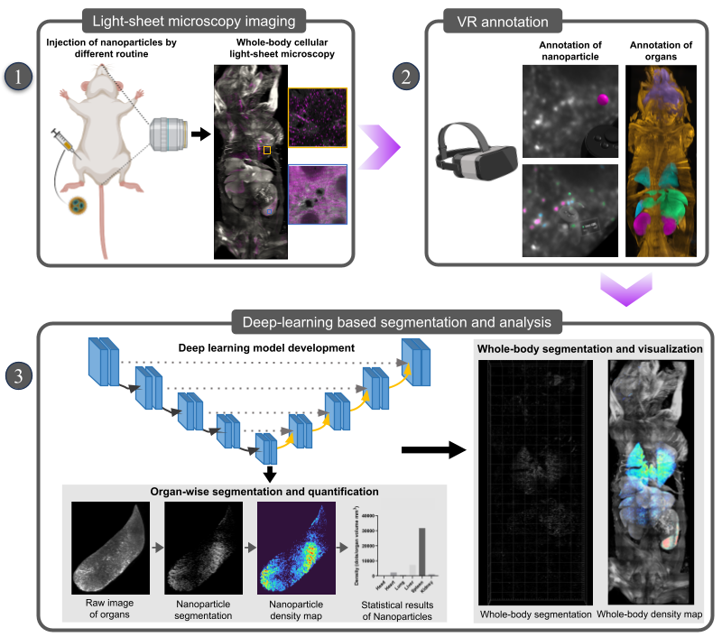

# SCP-Nano: Deep Learning Powered Imaging of Nanocarriers Across Entire Mouse Bodies at Single-Cell Resolution


Overview of SCP-Nano for whole-body image analysis of nanocarriers at single-cell resolution 

## Table of contents
1. [Introduction](#introduction)
2. [Requirements](#requirements)
3. [Installation](#installation)
4. [Pipeline workflow](#pipeline-workflow)

## Introduction
SCP-Nano (Single Cell Precision Nanocarrier Identification pipeline) is a pipeline combining whole-mouse body imaging at cellular resolution with deep learning to reveal the targeting of tens of millions of cells by nanocarriers. This repository contains the source code to run SCP-Nano from scratch.


## Requirements
### system requirements
Linux system with GPU (at least 10 GB GPU RAM) and CPU (at least 20 cores), and with 400 GB RAM. One mouse scan is x TB and the size is up to 20000 x 10000
x 1000, therefore SCP-Nano has such a large requirement on RAM.  

### data requirements
* Raw image data saved as a series of 16-bit TIFF files, one per z-plane. 

* Organ annotation of the raw image data saves as a series of 8-bit TIFF files, one per z-plane.

* Text file storing organ annotation label details following such a template: `organ label value: organ name`.  An example is provided [here](./example/organ_keys.txt). 

* Organize raw image TIFF series of nanoparticle signal channel (C01), organ annotation TIFF series (organ_mask) and organ label detail txt file (organ_keys.txt) of one mouse in the same directory as following:
   ```
    dir_wholebody_data/
    ├── C01/
    │   ├──C01_Z0000.tif
    │   ├──C01_Z0001.tif
    │   ├──...
    ├── organ_mask/
    │   ├──slice_0000.tif
    │   ├──slice_0001.tif
    │   ├──...
    ├── organ_keys.txt
    ```
    The TIFF series' prefixes don't have to match, but ensure that the z slice ID starts from 0000.

## Installation
1. Install [Anaconda](https://docs.anaconda.com/free/anaconda/install/linux/) to create and control virtual environments. 

2. Install [CUDA](https://docs.nvidia.com/cuda/cuda-installation-guide-linux/index.html) to utilize the power GPUs for deep learning 

3. Install Python 3.8 or higher version by Anaconda.
   ```
    conda create -n your_env python=3.8
	conda activate your_env
	```

4. Clone this repository into a local directory in your device by `git clone https://github.com/erturklab/SCP-Nano.git dir_you_save`  

5. Install libraries for general data processing by CPUs:
   ```
     cd dir_you_save_SCPNAno
     pip install -r requirements.txt
	```

6. Install [pytorch](https://pytorch.org/get-started/locally/), and then other libraries for deep learing segmentation using GPUs:
   ```     
     cd dir_you_save_SCPNAno/4_DL_segmentation_pred
     pip install -e .
	``` 

## Pipeline workflow


Overview of the SCP-Nano workflow. Individual steps are explained below.

### 1. Per-organ raw image and mask image cropping 
* Set the variable `dir_wholebody_data` in [1_organ_image_masking.py](1_organ_image_masking.py) to the directrory of one mouse data containing raw image TIFF series, organ annotation TIFF series and organ label detail txt file.

* Run 1_organ_image_masking.py. The resulted raw image TIFF series as well as the mask TIFF series for every organ will be respectively in the folders `dir_wholebody_data/organ_results/organ_{organ name}_raw` and  `dir_wholebody_data/organ_results/organ_{organ name}_mask`.


### 2. Crop organ raw images to small overlapping patches
* Set the variable `dir_wholebody_data` in [2_image_cropping.py](2_image_cropping.py) as in Step 1, and the variable `organ_name` as the name of the organ to be cropped.

* Set the variable `patch_size`, `patch_overlap`.

* Run 2_image_cropping.py. The resulted patches of whole-organ raw image will be saved in the folder `dir_wholebody_data/organ_results/organ_{organ name}_crop/local_C01/`.

### 3. Patch normalization before inference 
* Set the variable `dir_wholebody_data` in [3_patch_norm.py](3_patch_norm.py) as in Step 1, and the variable `cur_organ_name` as the name of the organ whose patches will be normalized.

* Run 3_patch_norm.py. Patches of whole-organ raw image will be normalized based on the intensity range of whole organ, and then saved in the folder `dir_wholebody_data/organ_results/organ_{organ name}_crop/local_C01_norm/`.

### 4. Deep-learning segmentation inference for patches of every organ
* Create folders `nnUNet_raw_data_base`, `nnUNet_preprocessed`, `RESULTS_FOLDER` under [this folder](./4_DL_segmentation_pred/).

* Download trained models from [here](https://drive.google.com/file/d/1Ad4iSqi6m1xHzLqiCaYzrymBZQLZeO3X/view?usp=sharing), then unzip the file to folder `RESULTS_FOLDER`.

* Run segmentation inference for patches of one organ:
  ```
   export nnUNet_raw_data_base="{dir_you_save_SCPNAno}/4_DL_segmentation_pred/nnUNet_raw_data_base"
   export nnUNet_preprocessed="{dir_you_save_SCPNAno}/4_DL_segmentation_pred/nnUNet_preprocessed"
   export RESULTS_FOLDER="{dir_you_save_SCPNAno}/4_DL_segmentation_pred/RESULTS_FOLDER"
   cd dir_you_save_SCPNAno/4_DL_segmentation_pred/nnunet/inference/
	```
  For LNP data segmentation:
  ```
  CUDA_VISIBLE_DEVICES=0 python predict_simple.py -i dir_wholebody_data/organ_results/organ_{organ name}_crop/local_C01_norm/ -o dir_wholebody_data/organ_results/organ_{organ name}_crop/local_C01_norm_infer/ -tr nnUNetTrainerV2_3 -ctr nnUNetTrainerV2CascadeFullRes -m 3d_fullres -p nnUNetPlansv2.1 -t Task901_LNP -chk model_best
  ```
  For EGFP data segmentation (`INPUT_FOLDER`: folder of raw EGFP image patches; `OUTPUT_FOLDER`: folder of segmentation prediction of patches): 
  ```
  CUDA_VISIBLE_DEVICES=0 python predict_simple.py -i INPUT_FOLDER -o OUTPUT_FOLDER -tr nnUNetTrainerV2_3 -m 3d_fullres -p nnUNetPlansv2.1 -t Task201_protein -chk model_best
  ```
  For AAV data segmentation (`INPUT_FOLDER`: folder of raw AAV image patches; `OUTPUT_FOLDER`: folder of segmentation prediction of patches):
  ```
  CUDA_VISIBLE_DEVICES=0 python predict_simple.py -i INPUT_FOLDER -o OUTPUT_FOLDER -tr nnUNetTrainerV2_3 -m 3d_fullres -p nnUNetPlansv2.1 -f all -t Task205_aav
  ```

### 5. Assembling patch prediction to get nanoparticle segmentation map for whole organ
* Set the variable `dir_wholebody_data` in [5_seg_rebuild.py](5_seg_rebuild.py) as in Step 1, and the variable `cur_organ_name` as the name of the organ.

* Run 5_seg_rebuild.py. The resulted segmentation map TIFF series will be saved in the folder `dir_wholebody_data/organ_results/organ_{organ name}_crop/TIFF_pred_norm/`.

### 6. Segmented nanoparticle quantification and density visualization per organ
* Set the variable `dir_wholebody_data` in [6_seg_analysis.py](6_seg_analysis.py) as in Step 1, and the variable `cur_organ_name` as the name of the organ.

* Run 6_seg_analysis.py. It will quantify segmented nanoparticles by relative intensity contrast sum, and generate the density map as a NifTi file.

### 7. Merge the density maps of all organs for whole body visualization.
* Run Step 2-6 for each organ to get the density maps for all organs.

* Set the variable `dir_wholebody_data` in [7_whole_body_heatmap_merge.py](7_whole_body_heatmap_merge.py) as in Step 1, and variable `organ_name_list` to the list of names of all annotated organs.

* Run 7_whole_body_heatmap_merge.py and the merged whole-body density map will be saved in the folder `dir_wholebody_data/density_combined_wholebody/`.

